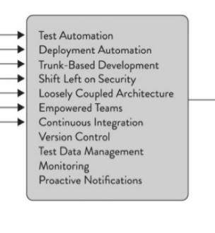

== Overview
The _"Software Development Mentorship"_ aims to review the overall approach to product development,
improving the quality, security of the products and velocity of the teams. The mentor will work with
the teams in several areas: Continuous Integration, Automatic deployments, Quality assurance
(automatic testing via unit/integration/e2e tests), Reproducible artifacts, development environment
among others.

The https://digitalpublicgoods.net/[Digital Public Good,window=_blank] (__DPG__) standard, defines 9
indicators to conform and be considered a digital public good . We’ll focus our attention on the
technical aspects of indicator number 4: *"Platform Independence"*.

We have 2 clear goals:

1. Improve the product development process
2. DPG Indicator No. 4: link:++++[Platform Independence]

== Introducing DevOps Research and Assessment (DORA)

The https://itrevolution.com/book/accelerate/[Accelerate,window=_blank] book compiles a four-year
research journey to investigate what *capabilities* and *practices* are important to accelerate the
development and delivery of software.

Some of these practices are _technical_ and others are _process_ and _organization_ related. We're
focusing on the *technical* ones

With the goal of a *DPG nomination* and *platform independence*, we’ll work on building the
technical capacity to improve software delivery.

Further reading:

* https://itrevolution.com/ACC-transformation-practices
* https://itrevolution.com/24-key-capabilities-to-drive-improvement-in-software-delivery/
* https://cloud.google.com/architecture/devops/capabilities
